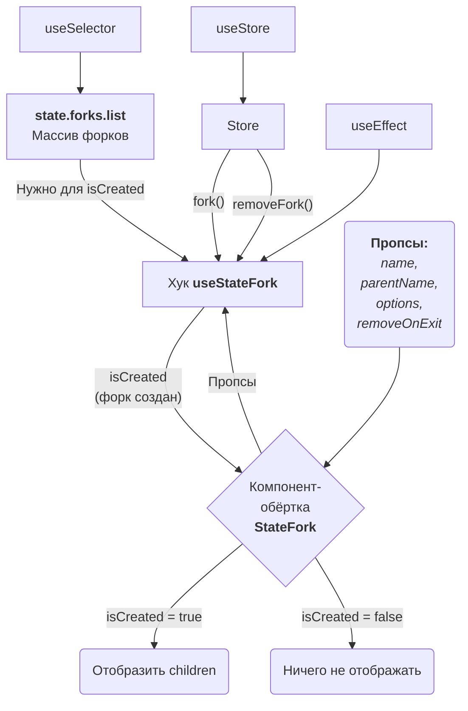

**Навигация**

[[_TOC_]]

# 🔥 Задача 2

**Рефакторинг по задаче 2**
- Задача со звёздочкой:

  Добавлен компонент-обёртка `StateFork`:
```jsx
// Компонент `StateFork` отображает `children` только после того,
// как форк среза стора для них успешно создан
{is('add-more-to-basket') && (
  <StateFork name={'add-more-to-basket'} parent='catalog'>
    <AddManyProducts context={'add-more-to-basket'} theme='big' indent={index} />
  </StateFork>
)}
```
  Чтобы компонент `StateFork` работал, добавлен хук `useStateFork`:
  - `useStateFork(name, parentName, opt = {}, removeOnExit = true)`
  Чтобы хук работал, в сторе (`src/store/index.js`) добавлены два метода:
  - `fork(name, parentName, opt = {})` где `opt` может содержать `{_id, configName, initStateName, initState}`
  - `removeFork(name)`
  Они меняют стейт через `this.setState(...)`. Ещё есть срез стора `ForkState` (`src/store/fork.js`) который хранит массив форков: можно из кода реагировать на его изменения (компонент `StateFork` использует это), проверять существует ли форк, итд. Кроме того, сейчас этот массив используется, чтобы предотвратить случайное удаление среза стора, не являющегося форком (то есть оригинала). Вот пример данных объекта внутри массива:
```js
{
  name: "myFork",
  parent: "catalog",
  options: {
    _id: "myFork",           // если не задано, то используется `name`
    configName: "catalog",   // если не задано, то используется `parent`
    initStateName: "myFork", // если не задано, то используется `name`
    initState: null,         // если не задано, то `null`
  },
}
```
- Сделал тёмную тему для логгера, когда меняется стейт. А то ничего не видно было. Тема установленная в операционной системе (`prefers-color-scheme`) определяется через `js`. К сожалению, это не работает, если поменять тему в браузере или только в консоли.

- Ширина поля ввода количества товаров теперь "расширяется" под длинну числа (минимальное значение - `2` символа), для этого использованы единицы ширины нулевого символа - `ch`. Кроме того, туда добавлены кнопки `-` и `+`. Всё вместе (инпут с кнопками `-` и `+`) вынесено в отдельный компонент `InputNumber`. Около кнопок оставлено небольшое пространство (`10px`) чтобы когда пользователь случайно не совсем попал по кнопке, не происходило снятия выделения с товара. Компонент имеет вот такой вид:
```jsx
<InputNumber
  placeholder={'шт'}
  minValue={1}    // Всё что меньше будет превращаться в `1`
  maxValue={9999} // Всё что больше будет превращаться в `9999`
  value={...}
  updateValue={...}
/>
```

- При массовом добавлении товаров учтен такой кейс: если пользователь в поле `шт` стёр число у нескольких из выбранных товаров (подсвечиваются красным), но не у всех, а затем нажал кнопку `Добавить выбранные`, то будут добавлены только товары с ненулевым количеством штук. Если у всех выбранных товаров стёрто поле `шт`, то кнопка `Добавить выбранные` не активна.
- После добавления компонента `InputNumber` для выбора количества товаров, кнопка `Изменить` была переименована в `Настроить` (предполагаются дополнительные опции, которых пока нет: `Экспресс доставка` например). И теперь эта кнопка появляется только когда курсор находится над плашкой. Причём кнопка не исчезает пока открыто диалоговое окно и курсор находится не над ней. И ещё в это время на кнопке крутится спиннер, ожидая закрытия диалогового окна :)
- Исправлена ошибка: если открыть `корзина` -> `выбрать ещё товар` -> `настроить`. И в диалоговом окне кликнуть на ссылку чтобы перейти на страницу товара, то теперь все диалоговые окна и модалка закрываются при переходе на другую страницу. Кроме того, если потом вернуться на главную, то будет видно, что спиннер с кнопки тоже сбросился (в функции очистки `useEffect` имитируем нажатие кнопки `отмена`).
- Теперь для закрытия диалогового окна экшн `.close()` может принимать `id` окна которое нужно закрыть, или массив айдишников. Если в `.close()` ничего не было передано, то закроется верхнее окно. Кроме того, был добавлен экшн `.closeAll()`.
- Исправлена ошибка: если перейти на страницу товара (`Article`) или логина, затем обновить страницу, затем `корзина` -> `выбрать ещё товар`, то теперь список товаров отображается.
- Кнопка `Сбросить` в фильтрах (`CatalogFilter`) теперь не активна, если состояние параметров фильтров соотвествут начальному стейту (`initState`). Таким образом мы убираем возможность нажать на кнопку, нажатие на которую не произведёт никаких изменений в интерфейсе, то есть для пользователя нажатие на неё выглядело бы как "неработающая кнопка, нажимаю, нажимаю, кнопка нажимается, но ничего не происходит". Сейчас она сбрасывает пагинацию, но по хорошему, она не должна была бы её сбрасывать, потому что визуально слишком далеко от неё (её связь с пагинацией не очевидна для пользователя). Оставил как есть, потому что в курсе кажется требовалось, чтобы кнопка `Сбросить` сбрасывала пагинацию. Для сравнения объектов использована функция `shallowequal`.

- Изменена логика вызова диалоговых окон, чтобы в месте вызова можно было бы передать колбэк для обработки в случае успеха:
```js
const callbacks = {
  // Открытие диалогового окна выбора количества для добавления в корзину
  addToBasketDialog: useCallback((item, pcs = 1) => {
    // Открываем диалоговое окно и передаём ему колбэк на случай успеха
    dispatch(dialogsActions.open(context.dialogContext, result => {
      // Обработка в случае успеха (добавим в корзину)
      store.actions.basket.addToBasket(result._id, result.pcs)
    }));
    dispatch(addProductActions.setData(item)); // Отправляем данные для диалогового окна
    dispatch(addProductActions.setPcs(pcs));   // Устанавливаем начальное значение количества
  }, [store, context.dialogContext]),
}
```

**Рефакторинг по задаче 1**
- Логика связанная с конкретными диалоговыми окнами убрана из контейнера `Windows`.
- Теперь в редьюсере `dialogs` только два метода: `.open()` и `.close()`. И мы храним только имена диалоговых окон плюс их айдишники (если `id` не задан, то по дефолту равен имени). Айдишники нужны чтобы в будущем иметь возможность одновременно вызвать две модалки с одним именем, но с разным содержанием (например два стандартных уведомления с разным текстом). Если это вдруг зачем-то потребуется.
- Открытие диалогового окна стало проще, теперь достаточно имени:
```js
dispatch(dialogsActions.open('add-to-basket')); // Открываем диалоговое окно
dispatch(addToBasketActions.setData(item));     // Отправляем ему данные (если требуется)
```
- В диалоговом окне добавления товара в корзину, на инпут добавлен автофокус.

**Сделано по задаче 2**
- Была решена интересная проблема с кастомным стором: при массовом быстром добавлении товаров добавлялся только один товар. Это происходило из-за того, что функция добавления товара является асинхронной и в ней мы создаем новый массив товаров на основе текущего стейта. Когда новый товар добавляется в момент, когда предыдущий ещё ожидает ответа от сервера, то в итоге, массив с новым товаром заменяет массив с предыдущим, потому что в качестве исходного массива у них был один и тот же массив.
- В окне массового добавления в корзину можно задать количество штук каждого товара (открывается ещё одно диалоговое окно), при этом отображается сумма и количество (в диалоговом окне тоже).
- Если попробовать повторно изменить количество штук для товара, то начальное значение будет не `1`, а то, которое было сохранено.
- Выделенные товары отмечаются цветом. Только для выделенных товаров отображается: кнопка `Изменить` (количество штук), количество штук и сумма. Для невыделенных товаров ничего из этого не отображается, только вместо суммы - цена.
- После закрытия и повторного открытия окна выделенные товары сбрасываются.
- Кнопка `Добавить выбранные` не активна, когда ни один итем не выбран.
- Кнопка в корзине `Выбрать ещё товар` когда в корзине нет ни одного товара имеет тест `Выбрать товар`.
- Сейчас диалоговые окна в контейнере `Windows` в `.map()` отображаются так:
```jsx
{ is('add-to-basket')   && <AddProduct context={'add-to-basket'} indent={index} /> }
{ is('add-to-selected') && <AddProduct context={'add-to-selected'} indent={index} /> }
//                          ^^^^^^^^^^ один компонент для разных контекстов
```

**Не успел по 2 задаче, доделаю позже**
- Сделать рефакторинг массового добавления товаров в корзину, сейчас они добавляются один за другим, а надо чтобы по каждому товару в один момент шли запросы к серверу (`Promise.all`). Или лучше в одном запросе к апи, если это будет работать.

# 🔥 Задача 1

**Сделано**
- Возможность открыть несколько диалоговых окон одно над другим и над модалкой `Корзина` (чтобы протестировать это добавлены дополнительные кнопки, открывающие дополнительное окно в диалоговом окне и в модалке).
- При надатии на кнопку `Добавить` в списке товаров, на ней крутится спиннер пока диалоговое окно открыто. То же работает и на странице товара (`Article`).
- Валидация инпута `2 шт` при добавлении в корзину (он не позволяет вводить левые символы)
  - `23kj2` -> `232`,
  - `0012`  -> `12`,
  - `0`     -> `1`
- Кнопка `Ок` становится неактивной, если поле `2 шт` пустое.
- Диалоговое окно, в отличие от модалки, закрывается по клику на окружающее пространство (то же, что нажать `Отмена`). В будущем можно добавить опцию для "важных" окон, чтобы их можно было закрыть только нажатием на `Ок` или `Отмена`.
- Дизайн диалогового окна позволяет добавить позже дополнительные платные опции (например `Экспресс доставка` или `Подарочная упаковка`) путём простого добавления этих опций и поля `Итого` внизу.

**Реализация нескольких диалоговых окон одно над другим:**

**Допущения:**
 - Модальное окно может быть только одно, в нём можно реализовать смену контента, если нужно несколько модалок.
 - Диалоговых окон может быть много.
 - Диалоговые окна отображаются всегда выше модальных.
 - Модальное окно и диалоговые окна могут вызывать новые диалоговые окна.
 - Диалоговое окно не должно вызывать модальное окно.
 - Диалоговые окна блокируют экран под собой, так же как и модальное окно (но без затенения),
   поэтому они будут закрыты в том же порядке, что и были открыты (но с конца естественно).
   Порядок важен для диалоговых окон, которые вызвали новые диалоговые окна и ждут их результат.
 - При клике на блокирующую подложку диалогового окна, оно закрывается как если бы была
   нажата кнопка "Отмена". В будущем, можно сделать опцию "Важное диалоговое окно", и такое
   окно будет закрываться исключительно по клику на одну из кнопок.
