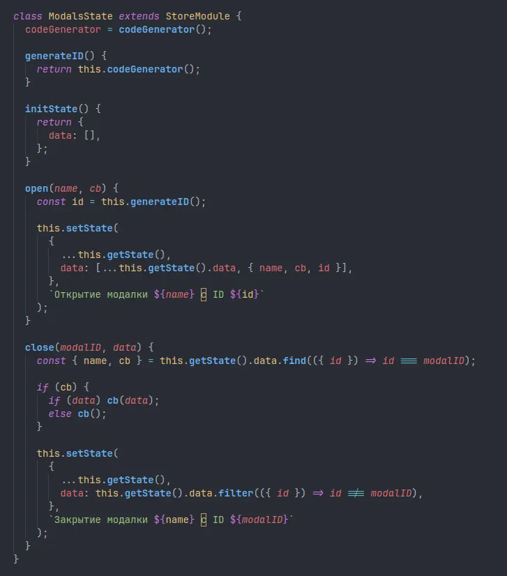

# Стажировка React 👉 _проект "Онлайн-магазин" + доп функции_

> Янв 2024 - Апр 2024 в компании N

## Требования, Запуск, Структура проекта

Minimum: _Nodejs v18_

Recommend: _Nodejs v20_ (смотри файл _node-version_)

**Шаг 1:** Сначала: `npm ci` или `npm install` (если _npm ci_ не сработал), далее `npm start` или `npm run dev` (смотри _npm scripts_)

**Шаг 2:** Каждая _feature_ в своей ветке. При переходе на ветку, повторяем _Шаг 1_ (могут быть новые зависимости)

## Деплой

Сложно реализовать единую сборку всех функций, тк слабо-связанные feature-branches, и разные сборщики (webpack & vitejs), и разные режимы рендера (SPA & SSR).

## Список реализованных функций по порядку

### Порядок описания

- Feature/Folder name --> Описание функции
- Скрин интерфейса или части кода

### (`/modals`) Создание менеджера модальных окон

- Доработать логику отображения окон и обеспечить передачу результата в метод закрытия окна.
- Реализовать многооконность и синхронизацию состояния между окнами.

### (`/typescript`) Проведение полной миграции проекта на TypeScript

- подключить TypeScript с опциями, разрешающими JavaScript и типы any (нестрогая типизация);
- типизировать компоненты, пропсы и callback на клик по кнопке/ссылке;
- использовать хук useSelector для типизации Store;
- оптимизировать процесс типизации Store, начав с жёсткого описания всех типов с дублированием и постепенно упрощая процесс создания нового модуля состояния;
- типизировать словари и функции i18n для работы подсказок доступных ключей при использовании функции t(text).

### (`/custom-select`) Создание кастомного компонента AutoComplete Select с загрузкой данных

- Кастомный компонент выбора варианта из выпадающего списка.
- Подгрузка списка при раскрытии выпадающего списка.
- Реализация фильтрации списка при вводе текста в зафиксированном поле фильтра.
- Управление компонентом через клавиатуру.
- Обработка случая, когда выпадающий список отображается внизу окна браузера.
- Реализация версии списка с множественным выбором и отображением выбранных опций.

### (`/chat`) Создание чата на WebSocket для авторизованных пользователей

1. Подписка на событие открытия сокета и отправка сообщений серверу.
2. Подписка на событие message для приема ответов от сервера.
3. Отправка токена авторизации после установки соединения.
4. Обработка ответов сервера на успешную или неудачную авторизацию.
5. Отправка нового сообщения с текстом и уникальным кодом.
6. Получение полного объекта сообщения от сервера.
7. Запрос свежих сообщений при коннекте.
8. Запрос старых сообщений.
9. Удаление всех сообщений с помощью вспомогательного метода.
10. Уведомление всех клиентов об удалении сообщений из базы данных.

### (`/vitejs`) Проведение миграции с Webpack на Vite

- сделать полную миграцию с webpack на vitejs

### (`/canvas`) Создание панели для свободного рисования на Canvas

- Рисование фигур программно на холсте
- Масштабирование холста
- Перемещение всего холста
- Перемещение фигур мышкой (drag-n-drop)
- Сделать анимацию фигур

### (`/ssr`) Реализация кастомного SSR на Vite

- add SSR via `renderToString`
- provide initialState of Application to server rendering
- add SSR via `renderToPipeableStream`

### (`/worker`) Создание GitHub мини-бота на WebWorker

- исследование возможностей `WebWorker`
- использование WebWorker в качестве чат-бота, и с функциями загрузки GitHub пользователей по запросу

### (`/admin`) Создание админ панели на Ant Design: каталог, редактирование товара

- add Admin panel with Ant Design

### (`/playwright`) Написание e2e тестов на главные функции проекта на Playwright

- add e2e tests with Playwright

