# Стажировка React 👉 _проект "Онлайн-магазин" + доп функции_

> Янв 2024 - Апр 2024 в компании N

## Требования, Запуск, Структура проекта

Minimum: _Nodejs v18_

Recommend: _Nodejs v20_ (смотри файл _node-version_)

**Шаг 1:** Сначала: `npm ci` или `npm install` (если _npm ci_ не сработал), далее `npm start` или `npm run dev` (смотри _npm scripts_)

**Шаг 2:** Каждая _feature_ в своей ветке. При переходе на ветку, повторяем _Шаг 1_ (могут быть новые зависимости)

## Деплой

Сложно реализовать единую сборку всех функций, тк слабо-связанные feature-branches, и разные сборщики (webpack & vitejs), и разные режимы рендера (SPA & SSR).

## Список реализованных функций по порядку

### Порядок описания

- Feature/Folder name --> Описание функции
- Скрин интерфейса или части кода

### (`/modals`) Создание менеджера модальных окон

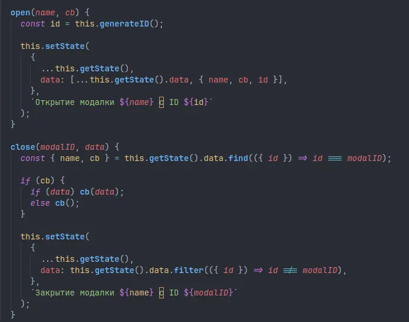

### (`/typescript`) Проведение полной миграции проекта на TypeScript

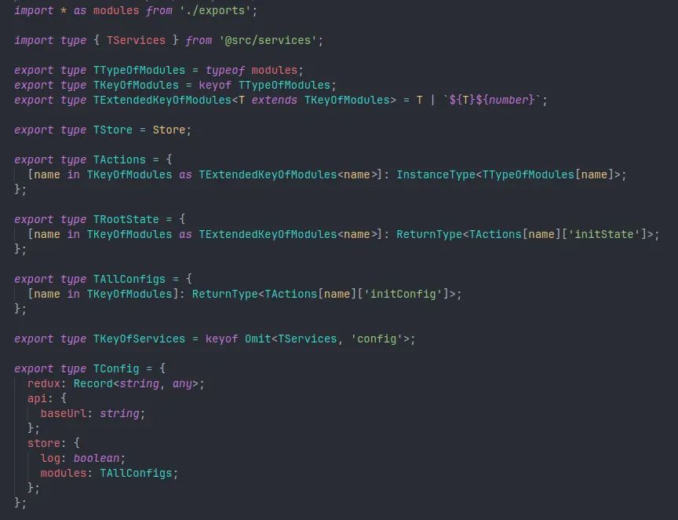

### (`/custom-select`) Создание кастомного компонента AutoComplete Select с загрузкой данных

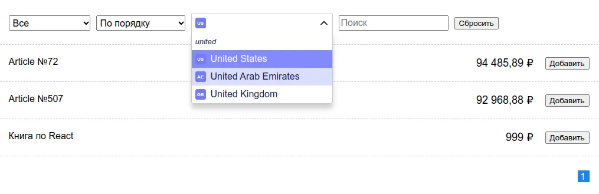

### (`/chat`) Создание чата на WebSocket для авторизованных пользователей

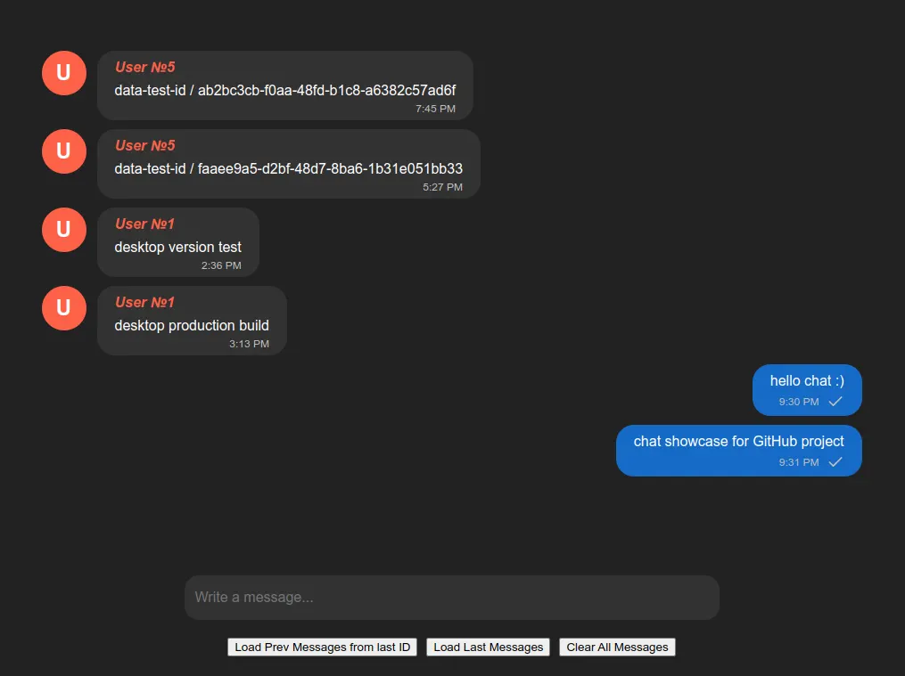

### (`/vitejs`) Проведение миграции с Webpack на Vite

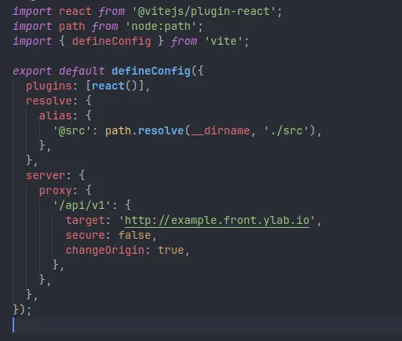

### (`/canvas`) Создание панели для свободного рисования на Canvas

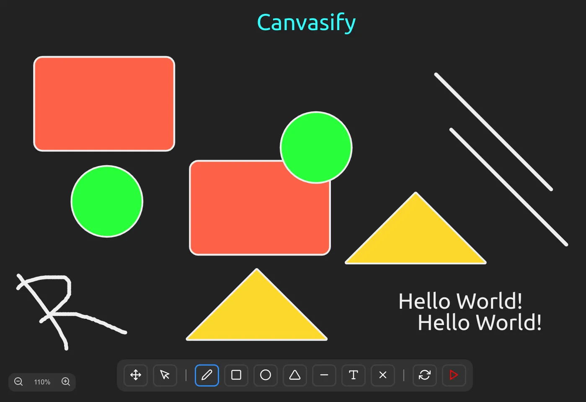

### (`/ssr`) Реализация кастомного SSR на Vite

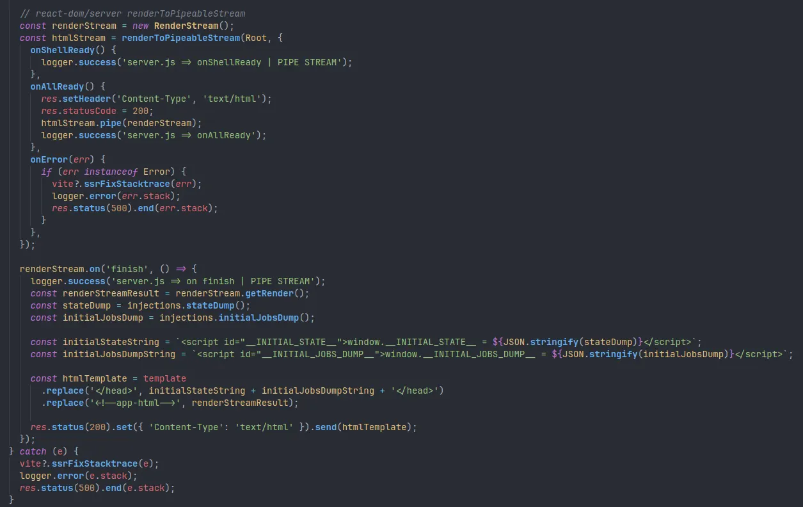

### (`/worker`) Создание GitHub мини-бота на WebWorker

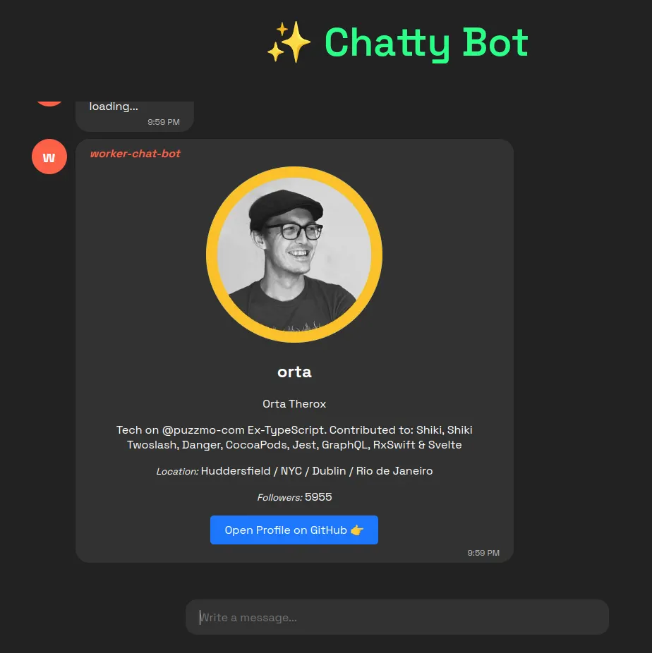

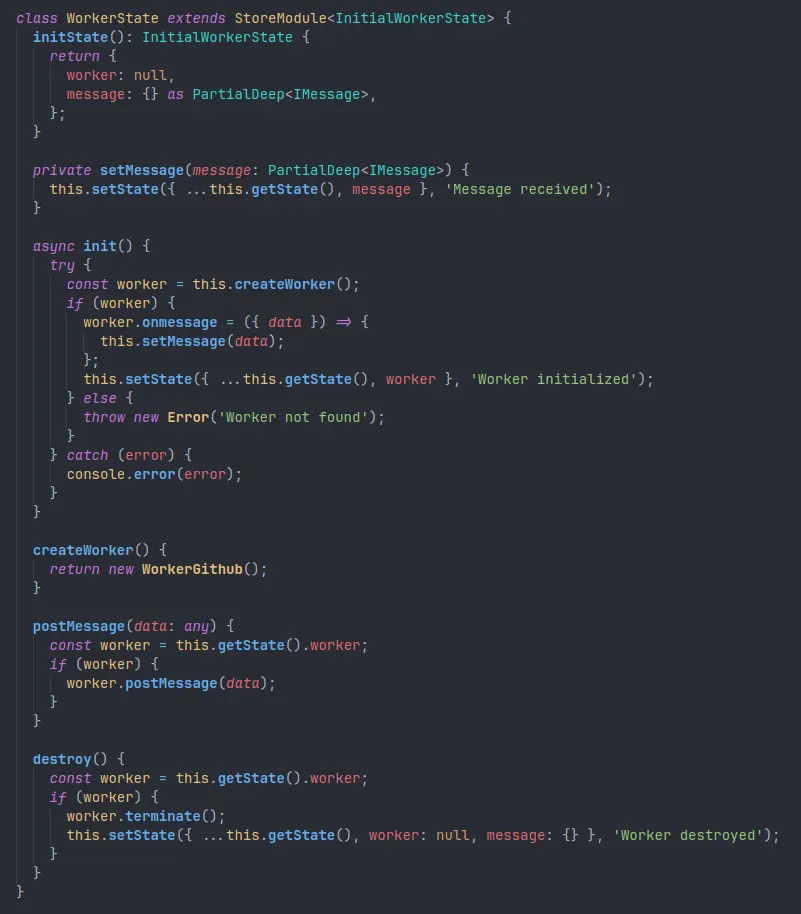

### (`/admin`) Создание админ панели на Ant Design: каталог, редактирование товара

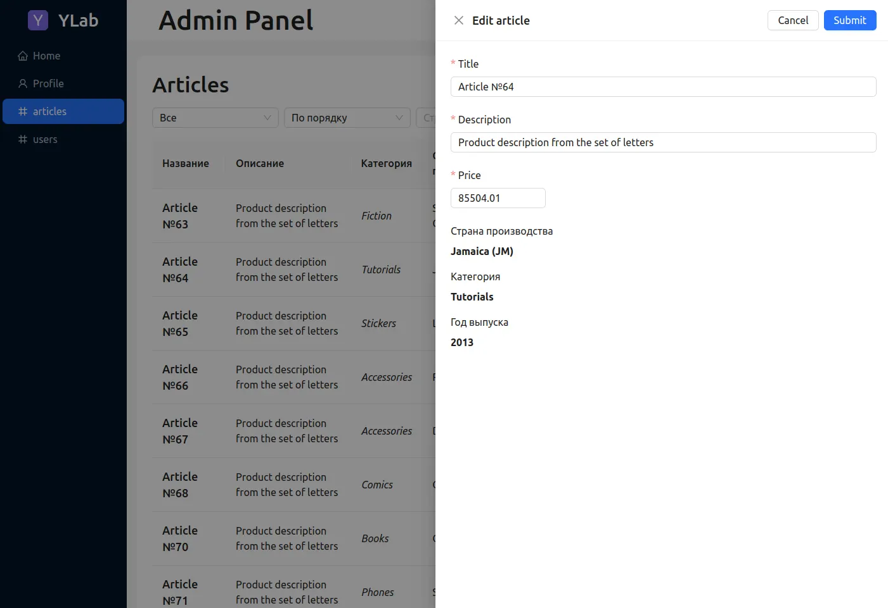

### (`/playwright`) Написание e2e тестов на главные функции проекта на Playwright

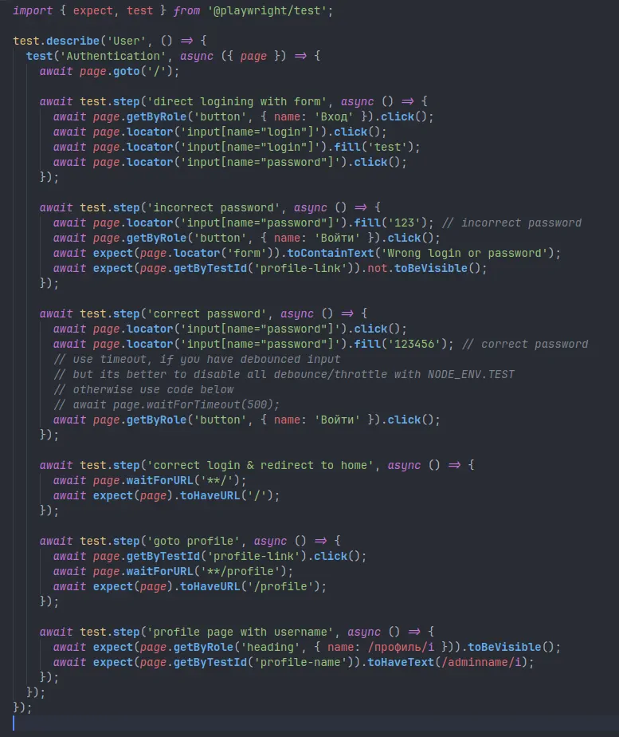
